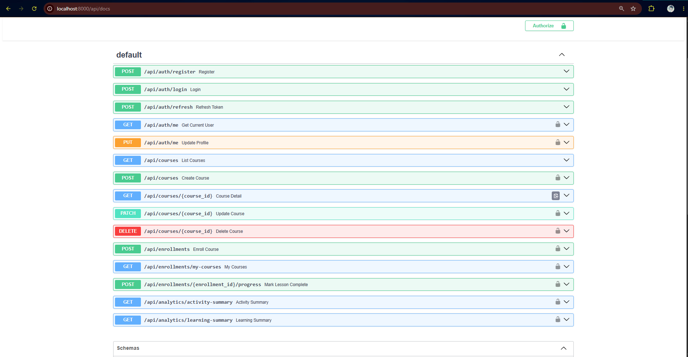
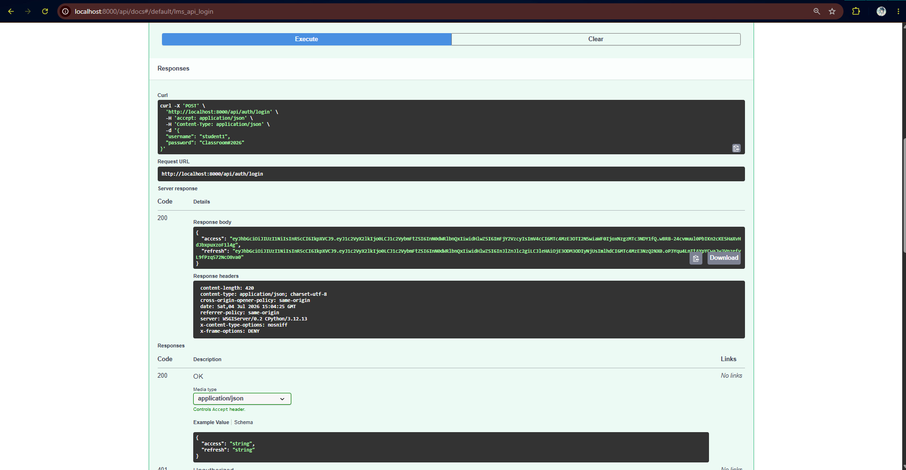
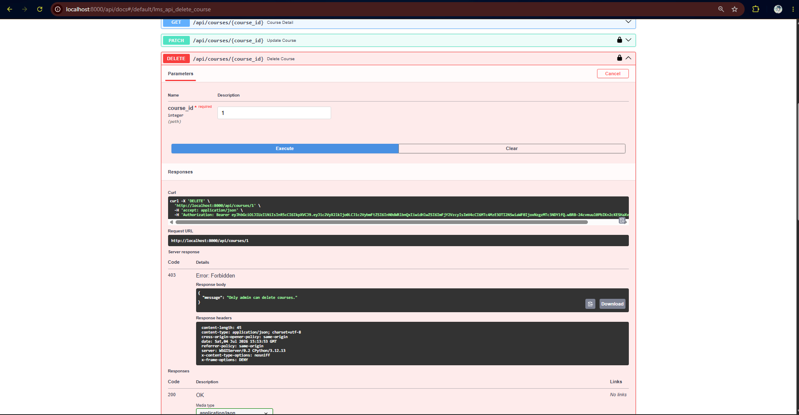

# FINAL PROJECT REPORT

# Simple LMS Extended Backend

## 1. Identitas

| Keterangan           | Isi                                                       |
| -------------------- | --------------------------------------------------------- |
| Nama                 | Abubakar Rhafly Eka Putera                                |
| NIM                  | A11.2023.15240                                            |
| Kelas                | A11.4602                                                  |
| Mata Kuliah          | Pemrograman Sisi Server                                   |
| Project              | Simple LMS Extended Backend                               |
| URL Repository       | https://github.com/AbubakarRhafly/Docker-Django-Fundation |
| Branch Final Project | final-project-simple-lms                                  |

---

## 2. Deskripsi Project

Simple LMS Extended Backend adalah project backend Learning Management System sederhana yang dikembangkan menggunakan Django. Project ini merupakan lanjutan dari Progress 1 sampai Progress 4.

Pada Progress 1, project difokuskan pada setup Docker, Docker Compose, Django, dan PostgreSQL. Pada Progress 2, project dikembangkan dengan desain database dan implementasi Django ORM untuk model utama LMS. Pada Progress 3, project dikembangkan menjadi REST API menggunakan Django Ninja, JWT Authentication, Role-Based Access Control, dan Swagger Documentation. Pada Progress 4 dan final project ini, sistem dikembangkan lebih lanjut dengan fitur advanced backend seperti Redis caching, MongoDB analytics, Celery asynchronous task, RabbitMQ message broker, Celery Beat scheduled task, dan Flower monitoring.

Tujuan utama dari project ini adalah membuat backend LMS yang lebih realistis, terstruktur, dapat dijalankan melalui Docker Compose, dan dapat diuji melalui Swagger/OpenAPI documentation.

---

## 3. Fitur Dasar yang Sudah Berjalan

Berikut fitur dasar yang sudah tersedia pada project Simple LMS:

| No | Fitur Dasar                                                | Status  |
| -- | ---------------------------------------------------------- | ------- |
| 1  | Docker dan Docker Compose                                  | Selesai |
| 2  | PostgreSQL database                                        | Selesai |
| 3  | Django project structure                                   | Selesai |
| 4  | Model User, Category, Course, Lesson, Enrollment, Progress | Selesai |
| 5  | Django ORM dan migration                                   | Selesai |
| 6  | REST API menggunakan Django Ninja                          | Selesai |
| 7  | JWT Authentication                                         | Selesai |
| 8  | Role-Based Access Control admin, instructor, student       | Selesai |
| 9  | Course API                                                 | Selesai |
| 10 | Enrollment API                                             | Selesai |
| 11 | Lesson progress API                                        | Selesai |
| 12 | Swagger/OpenAPI documentation                              | Selesai |

---

## 4. Fitur Tambahan yang Dipilih

Pada final project ini, saya memilih beberapa fitur tambahan dari kategori Redis/Performance, MongoDB/Analytics, dan Celery/Async Processing. Total poin fitur tambahan yang dikerjakan melebihi 50 poin, tetapi sesuai ketentuan final project, nilai fitur tambahan maksimal dihitung 50 poin.

| No | Fitur Tambahan                                    | Kategori                           | Poin | Status  |
| -- | ------------------------------------------------- | ---------------------------------- | ---: | ------- |
| 1  | Redis caching untuk course list dan course detail | Redis, Caching, Performance        |   12 | Selesai |
| 2  | Cache invalidation strategy                       | Redis, Caching, Performance        |   12 | Selesai |
| 3  | API rate limiting berbasis Redis                  | Redis, Caching, Performance        |   12 | Selesai |
| 4  | Activity logging ke MongoDB                       | MongoDB dan Analytics              |   15 | Selesai |
| 5  | Learning analytics collection                     | MongoDB dan Analytics              |   15 | Selesai |
| 6  | Aggregation query MongoDB                         | MongoDB dan Analytics              |   15 | Selesai |
| 7  | Email notification async menggunakan Celery       | Celery, RabbitMQ, Async Processing |   12 | Selesai |
| 8  | Generate certificate/report async                 | Celery, RabbitMQ, Async Processing |   18 | Selesai |
| 9  | Scheduled task menggunakan Celery Beat            | Celery, RabbitMQ, Async Processing |   15 | Selesai |
| 10 | Flower monitoring                                 | Celery, RabbitMQ, Async Processing |    8 | Selesai |

---

## 5. Penjelasan Implementasi

### 5.1 Docker Compose Multi-Service

Project ini dijalankan menggunakan Docker Compose. Pada final project, Docker Compose menjalankan beberapa service utama:

| Service         | Fungsi                                                            |
| --------------- | ----------------------------------------------------------------- |
| `web`           | Menjalankan Django API                                            |
| `db`            | Menjalankan PostgreSQL database                                   |
| `redis`         | Digunakan untuk caching, rate limiting, dan Celery result backend |
| `mongodb`       | Menyimpan activity logs dan learning analytics                    |
| `rabbitmq`      | Message broker untuk Celery                                       |
| `celery-worker` | Menjalankan asynchronous task                                     |
| `celery-beat`   | Menjalankan scheduled task                                        |
| `flower`        | Monitoring Celery worker dan task                                 |

Bukti semua service berjalan dapat dilihat pada screenshot berikut:


---

### 5.2 Redis Caching

Redis digunakan untuk menyimpan cache pada endpoint course agar response lebih cepat ketika request yang sama dilakukan berulang.

Endpoint yang menggunakan Redis cache:

```txt
GET /api/courses
GET /api/courses/{course_id}
```

Key Redis yang digunakan:

```txt
course_list
course_detail_{course_id}
```

Contoh key:

```txt
:1:course_list
:1:course_detail_1
```

Cache memiliki TTL sehingga data tidak disimpan selamanya. Pengujian dilakukan melalui Redis CLI dengan perintah:

```bash
docker exec -it simple_lms_redis redis-cli
SELECT 1
KEYS *
TTL ":1:course_list"
```

Bukti Redis cache dan TTL aktif:


---

### 5.3 Cache Invalidation Strategy

Cache invalidation diterapkan agar data cache tetap konsisten ketika data course berubah.

Strategi invalidation:

| Aksi          | Cache yang Dihapus                            |
| ------------- | --------------------------------------------- |
| Create course | `course_list`                                 |
| Update course | `course_list` dan `course_detail_{course_id}` |
| Delete course | `course_list` dan `course_detail_{course_id}` |

Dengan strategi ini, API tidak menampilkan data lama setelah ada perubahan course.

---

### 5.4 Rate Limiting Berbasis Redis

Rate limiting diterapkan untuk membatasi jumlah request ke endpoint course.

Batas request:

```txt
60 requests per minute
```

Jika request melebihi batas, API mengembalikan response:

```json
{
  "message": "Rate limit exceeded. Maximum 60 requests per minute."
}
```

Pengujian dilakukan menggunakan PowerShell:

```powershell
for ($i=1; $i -le 65; $i++) { curl.exe http://localhost:8000/api/courses }
```

Bukti pengujian rate limiting:


---

### 5.5 MongoDB Activity Logs

MongoDB digunakan untuk menyimpan activity logs dalam bentuk document. Activity logs mencatat aktivitas penting yang dilakukan oleh user maupun anonymous user.

Collection yang digunakan:

```txt
activity_logs
```

Contoh aktivitas yang dicatat:

```txt
course_list_viewed
course_detail_viewed
student_enrolled
lesson_completed
```

Pengujian dilakukan menggunakan MongoDB shell:

```bash
docker exec -it simple_lms_mongodb mongosh
use simple_lms_logs
show collections
db.activity_logs.find().pretty()
```

Bukti activity logs tersimpan di MongoDB:


---

### 5.6 MongoDB Learning Analytics

Learning analytics digunakan untuk mencatat aktivitas pembelajaran student.

Collection yang digunakan:

```txt
learning_analytics
```

Contoh event yang dicatat:

```txt
course_enrolled
lesson_completed
```

Data ini dapat digunakan untuk melihat aktivitas belajar student berdasarkan course dan lesson.

Pengujian dilakukan menggunakan:

```javascript
db.learning_analytics.find().pretty()
```

Bukti learning analytics tersimpan di MongoDB:


---

### 5.7 MongoDB Aggregation Query

Aggregation query dibuat untuk menghasilkan laporan ringkas dari data MongoDB.

Endpoint aggregation:

```txt
GET /api/analytics/activity-summary
GET /api/analytics/learning-summary
```

`activity-summary` menampilkan total aktivitas berdasarkan action.
`learning-summary` menampilkan total aktivitas pembelajaran berdasarkan course dan event type.

Endpoint ini membutuhkan autentikasi JWT dan hanya dapat diakses oleh admin.

Bukti activity summary berjalan:


Bukti learning summary berjalan:


---

### 5.8 Celery Async Tasks

Celery digunakan untuk menjalankan task secara asynchronous agar proses berat tidak langsung membebani request API.

Empat task utama yang dibuat:

| Task                       | Fungsi                                             |
| -------------------------- | -------------------------------------------------- |
| `send_enrollment_email`    | Simulasi pengiriman email saat student enroll      |
| `generate_certificate`     | Generate certificate number setelah course selesai |
| `update_course_statistics` | Mengupdate statistik course                        |
| `export_course_report`     | Generate report course secara async                |

Task diuji melalui Django shell:

```bash
docker exec -it simple_lms_web python manage.py shell
```

Kemudian menjalankan:

```python
from lms.tasks import send_enrollment_email, generate_certificate, update_course_statistics, export_course_report

send_enrollment_email.delay(1)
generate_certificate.delay(1)
update_course_statistics.delay()
export_course_report.delay()
```

Hasil task dapat dilihat melalui Flower dashboard. Semua task berhasil berjalan dengan status `SUCCESS`.

Bukti Celery tasks berhasil:


---

### 5.9 RabbitMQ Message Broker

RabbitMQ digunakan sebagai message broker untuk Celery. Django mengirim task ke RabbitMQ, kemudian Celery worker mengambil task tersebut untuk diproses.

RabbitMQ dashboard dapat diakses melalui:

```txt
http://localhost:15672
```

Login:

```txt
username: guest
password: guest
```

Bukti RabbitMQ dashboard berjalan:


---

### 5.10 Celery Beat Scheduled Task

Celery Beat digunakan untuk menjalankan scheduled task secara otomatis.

Task yang dijalankan berkala:

```txt
update_course_statistics
```

Schedule:

```txt
Setiap 5 menit
```

Task ini digunakan untuk memperbarui statistik course secara otomatis tanpa request manual.

---

### 5.11 Flower Monitoring

Flower digunakan untuk memonitor Celery worker dan task.

Flower dapat diakses melalui:

```txt
http://localhost:5555
```

Pada Flower, dapat dilihat:

* Worker status
* Task yang diproses
* Status task success/failed
* Runtime task
* Result task

Bukti Flower dashboard berjalan:


---

## 6. Cara Menjalankan Project

### 6.1 Clone Repository

```bash
git clone https://github.com/AbubakarRhafly/Docker-Django-Fundation.git
cd Docker-Django-Fundation
```

### 6.2 Checkout Branch Final Project

```bash
git checkout final-project-simple-lms
```

### 6.3 Buat File `.env`

Copy file `.env.example` menjadi `.env`.

```bash
cp .env.example .env
```

Untuk Windows PowerShell:

```powershell
copy .env.example .env
```

### 6.4 Jalankan Docker Compose

```bash
docker compose up --build
```

### 6.5 Jalankan Migration

Jika migration belum berjalan otomatis, jalankan:

```bash
docker exec -it simple_lms_web python manage.py migrate
```

### 6.6 Membuka API Documentation

Swagger/OpenAPI dapat diakses melalui:

```txt
http://localhost:8000/api/docs
```

### 6.7 Membuka Flower

```txt
http://localhost:5555
```

### 6.8 Membuka RabbitMQ Dashboard

```txt
http://localhost:15672
```

Login:

```txt
guest / guest
```

---

## 7. Akun Demo

Akun demo yang digunakan untuk testing:

| Role       | Username      | Password          |
| ---------- | ------------- | ----------------- |
| Admin      | `admin123`    | `polke001`        |
| Instructor | `instructor1` | `Campus#2026AI`   |
| Instructor | `instructor2` | `Training@2026Lab`|
| Student    | `student1`    | `Classroom#2026`  |
| Student    | `student2`    | `Practice@2026AI` |

---

## 8. Endpoint Penting

### Authentication

| Method | Endpoint             | Deskripsi                       |
| ------ | -------------------- | ------------------------------- |
| POST   | `/api/auth/register` | Register user                   |
| POST   | `/api/auth/login`    | Login dan mendapatkan JWT token |
| POST   | `/api/auth/refresh`  | Refresh access token            |
| GET    | `/api/auth/me`       | Melihat user yang sedang login  |
| PUT    | `/api/auth/me`       | Update profile user             |

### Course

| Method | Endpoint                   | Deskripsi                           |
| ------ | -------------------------- | ----------------------------------- |
| GET    | `/api/courses`             | Menampilkan list course             |
| GET    | `/api/courses/{course_id}` | Menampilkan detail course           |
| POST   | `/api/courses`             | Instructor membuat course           |
| PATCH  | `/api/courses/{course_id}` | Instructor mengubah course miliknya |
| DELETE | `/api/courses/{course_id}` | Admin menghapus course              |

### Enrollment dan Progress

| Method | Endpoint                                    | Deskripsi                           |
| ------ | ------------------------------------------- | ----------------------------------- |
| POST   | `/api/enrollments`                          | Student enroll ke course            |
| GET    | `/api/enrollments/my-courses`               | Student melihat course yang diikuti |
| POST   | `/api/enrollments/{enrollment_id}/progress` | Student menandai lesson selesai     |

### Analytics

| Method | Endpoint                          | Deskripsi                                |
| ------ | --------------------------------- | ---------------------------------------- |
| GET    | `/api/analytics/activity-summary` | Admin melihat summary activity logs      |
| GET    | `/api/analytics/learning-summary` | Admin melihat summary learning analytics |

---

## 9. Screenshot / Bukti Pengujian

Semua screenshot bukti pengujian disimpan di folder:

```txt
lms/images/progress4/
```

### 9.1 Docker Services dan Redis Cache


### 9.2 Rate Limiting


### 9.3 MongoDB Activity Logs


### 9.4 MongoDB Learning Analytics


### 9.5 MongoDB Aggregation Activity Summary


### 9.6 MongoDB Aggregation Learning Summary


### 9.7 Flower Dashboard


### 9.8 Celery Tasks Success


### 9.9 RabbitMQ Dashboard


### 9.10 Swagger API Documentation



### 9.11 JWT Login Success

Berikut adalah hasil login menggunakan endpoint `POST /api/auth/login`. Sistem berhasil mengembalikan token JWT berupa `access` dan `refresh`.



### 9.12 RBAC Student Forbidden

Pengujian ini dilakukan dengan login sebagai `student1`, kemudian mencoba mengakses endpoint `DELETE /api/courses/{course_id}`. Endpoint tersebut hanya boleh diakses oleh admin. Hasil pengujian menunjukkan response `403 Forbidden`, sehingga role-based access control berhasil berjalan.



---

## 10. Pengujian yang Dilakukan

| No |   Pengujian                |                     Cara Uji                   |     Hasil     |
|----|----------------------------|------------------------------------------------|---------------|
| 1  | Docker Compose             | `docker compose up --build` dan `docker ps`    | Berhasil      |
| 2  | Swagger API                | Membuka `/api/docs`                            | Berhasil      |
| 3  | JWT Login                  | `POST /api/auth/login`                         | Berhasil      |
| 4  | RBAC Student Forbidden     | Student mencoba `DELETE /api/courses/1`        | 403 Forbidden |
| 5  | Course List API            | `GET /api/courses`                             | 200 OK        |
| 6  | Course Detail API          | `GET /api/courses/1`                           | 200 OK        |
| 7  | Redis Cache                | `SELECT 1`, `KEYS *`, `TTL`                    | Berhasil      |
| 8  | Rate Limiting              | 65 request ke `/api/courses`                   | Limit berjalan|
| 9  | MongoDB Activity Logs      | `db.activity_logs.find().pretty()`             | Berhasil      |
| 10 | MongoDB Learning Analytics | `db.learning_analytics.find().pretty()`        | Berhasil      |
| 11 | Activity Summary           | `GET /api/analytics/activity-summary`          | 200 OK        |
| 12 | Learning Summary           | `GET /api/analytics/learning-summary`          | 200 OK        |
| 13 | Celery Tasks               | Menjalankan 4 task dari Django shell           | SUCCESS       |
| 14 | Flower Monitoring          | Membuka `localhost:5555`                       | Berhasil      |
| 15 | RabbitMQ Dashboard         | Membuka `localhost:15672`                      | Berhasil      |

---

## 11. Kendala dan Solusi

### 11.1 Port 8000 Sudah Digunakan

Kendala:

```txt
Bind for 0.0.0.0:8000 failed: port is already allocated
```

Solusi:

Saya mengecek container yang sedang berjalan menggunakan:

```bash
docker ps
```

Kemudian menghentikan container lain yang menggunakan port 8000, lalu menjalankan ulang Docker Compose.

---

### 11.2 Redis Key Tidak Muncul Saat Dicek

Kendala:

Saat menjalankan `KEYS *` di Redis, key cache tidak muncul.

Solusi:

Redis cache Django menggunakan database 1, sedangkan Redis CLI default masuk ke database 0. Solusinya adalah menjalankan:

```redis
SELECT 1
KEYS *
```

Setelah itu key seperti `:1:course_list` dan `:1:course_detail_1` berhasil muncul.

---

### 11.3 Endpoint Protected Menghasilkan 401 Unauthorized

Kendala:

Endpoint enrollment dan analytics menghasilkan 401 Unauthorized.

Solusi:

Endpoint tersebut membutuhkan JWT token. Saya login melalui endpoint `/api/auth/login`, mengambil access token, lalu memasukkannya ke Swagger Authorize dengan format Bearer token.

---

### 11.4 Flower Connection Refused

Kendala:

Flower sempat gagal connect ke RabbitMQ karena RabbitMQ belum siap.

Solusi:

Saya menjalankan ulang service Flower setelah RabbitMQ aktif:

```bash
docker compose up -d flower
```

Setelah itu Flower berhasil berjalan di port 5555.

---

## 12. Kesimpulan

Final project Simple LMS Extended Backend berhasil dikembangkan dari project LMS sebelumnya menjadi backend yang lebih lengkap dan realistis. Project ini sudah mendukung REST API, JWT authentication, RBAC, Docker Compose, PostgreSQL, Redis caching, rate limiting, MongoDB activity logs, learning analytics, Celery asynchronous task, RabbitMQ message broker, Celery Beat scheduled task, dan Flower monitoring.

Melalui project ini, saya memahami cara mengintegrasikan beberapa teknologi backend dalam satu sistem menggunakan Docker Compose. Saya juga mempelajari pentingnya caching, background task, activity logging, analytics, dokumentasi API, serta monitoring service agar backend lebih siap digunakan dalam skenario nyata.
