# Progress 4: Simple LMS - Advanced Features & Integration

## Deskripsi Project

Project ini merupakan lanjutan dari Progress 3 pada pengembangan backend Simple LMS. Pada Progress sebelumnya, sistem sudah memiliki REST API, JWT Authentication, Role-Based Access Control, Swagger Documentation, dan endpoint utama untuk course, enrollment, serta lesson progress.

Pada Progress 4 ini, saya mengembangkan fitur lanjutan dengan mengintegrasikan beberapa teknologi backend tambahan, yaitu Redis, MongoDB, RabbitMQ, Celery, Celery Beat, dan Flower. Integrasi ini bertujuan untuk meningkatkan performa, menyediakan activity logging, mendukung asynchronous task processing, serta memberikan monitoring terhadap task yang berjalan.

---

## Tujuan Progress 4

Tujuan dari Progress 4 ini adalah:

1. Mengimplementasikan Redis caching untuk endpoint course.
2. Mengimplementasikan rate limiting menggunakan Redis.
3. Mengintegrasikan MongoDB untuk activity logs dan learning analytics.
4. Membuat aggregation query untuk laporan dari data MongoDB.
5. Mengimplementasikan Celery untuk asynchronous task processing.
6. Menggunakan RabbitMQ sebagai message broker.
7. Menggunakan Celery Beat untuk scheduled task.
8. Menggunakan Flower untuk monitoring Celery worker dan task.
9. Memperbarui Docker Compose agar semua service dapat berjalan bersama.

---

## Teknologi yang Digunakan

Teknologi yang digunakan pada Progress 4:

* Python
* Django
* Django Ninja
* PostgreSQL
* Redis
* MongoDB
* RabbitMQ
* Celery
* Celery Beat
* Flower
* Docker
* Docker Compose
* Swagger API Documentation

---

## Docker Services

Pada Progress 4, `docker-compose.yml` diperbarui agar dapat menjalankan beberapa service berikut:

| Service         | Fungsi                                                            |
| --------------- | ----------------------------------------------------------------- |
| `web`           | Menjalankan Django application                                    |
| `db`            | Menjalankan PostgreSQL database                                   |
| `redis`         | Digunakan untuk caching, rate limiting, dan Celery result backend |
| `mongodb`       | Menyimpan activity logs dan learning analytics                    |
| `rabbitmq`      | Message broker untuk Celery                                       |
| `celery-worker` | Menjalankan asynchronous tasks                                    |
| `celery-beat`   | Menjalankan scheduled tasks                                       |
| `flower`        | Monitoring Celery worker dan tasks                                |

Untuk menjalankan semua service:

```bash
docker compose up --build
```

Untuk melihat container yang sedang berjalan:

```bash
docker ps
```

### Screenshot Docker Services dan Redis

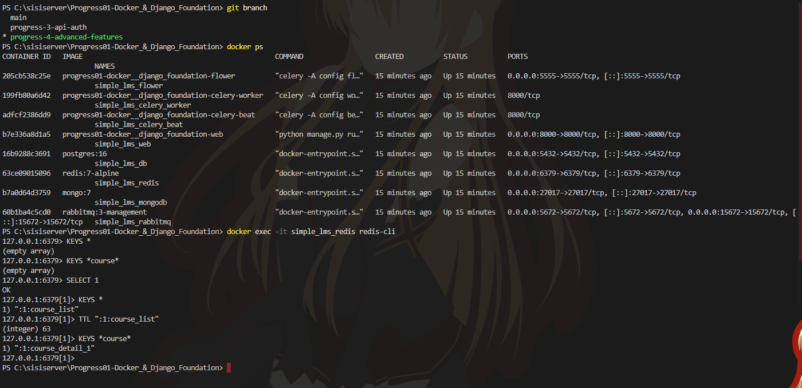

---

## Redis Integration

Redis digunakan untuk meningkatkan performa API dengan menyimpan data sementara dalam cache. Pada Progress 4, Redis diterapkan pada endpoint course.

### Course List Caching

Endpoint:

```txt
GET /api/courses
```

Endpoint ini menyimpan hasil daftar course ke Redis dengan key:

```txt
course_list
```

Jika data masih tersedia di cache, API akan mengambil data dari Redis tanpa menjalankan query database ulang.

### Course Detail Caching

Endpoint:

```txt
GET /api/courses/{course_id}
```

Endpoint ini menyimpan detail course ke Redis dengan key:

```txt
course_detail_{course_id}
```

Contoh:

```txt
course_detail_1
```

### Cache Invalidation Strategy

Cache dihapus saat data course berubah. Invalidation dilakukan pada beberapa kondisi:

| Aksi          | Cache yang Dihapus                            |
| ------------- | --------------------------------------------- |
| Create course | `course_list`                                 |
| Update course | `course_list` dan `course_detail_{course_id}` |
| Delete course | `course_list` dan `course_detail_{course_id}` |

Dengan strategi ini, data yang ditampilkan oleh API tetap konsisten setelah terjadi perubahan data.

### Redis CLI Testing

Redis diuji menggunakan command:

```bash
docker exec -it simple_lms_redis redis-cli
```

Kemudian memilih Redis database 1:

```redis
SELECT 1
```

Melihat key Redis:

```redis
KEYS *
```

Melihat TTL cache:

```redis
TTL ":1:course_list"
```

Hasil pengujian menunjukkan bahwa key cache berhasil dibuat dan memiliki TTL aktif.

---

## Rate Limiting

Rate limiting diterapkan menggunakan Redis untuk membatasi jumlah request ke endpoint course.

Batas yang diterapkan:

```txt
60 requests per minute
```

Jika jumlah request melebihi batas, API akan mengembalikan response:

```json
{
  "message": "Rate limit exceeded. Maximum 60 requests per minute."
}
```

Pengujian dilakukan menggunakan PowerShell:

```powershell
for ($i=1; $i -le 65; $i++) { curl.exe http://localhost:8000/api/courses }
```

Setelah request melewati batas, sistem berhasil memberikan response rate limit.

### Screenshot Rate Limiting

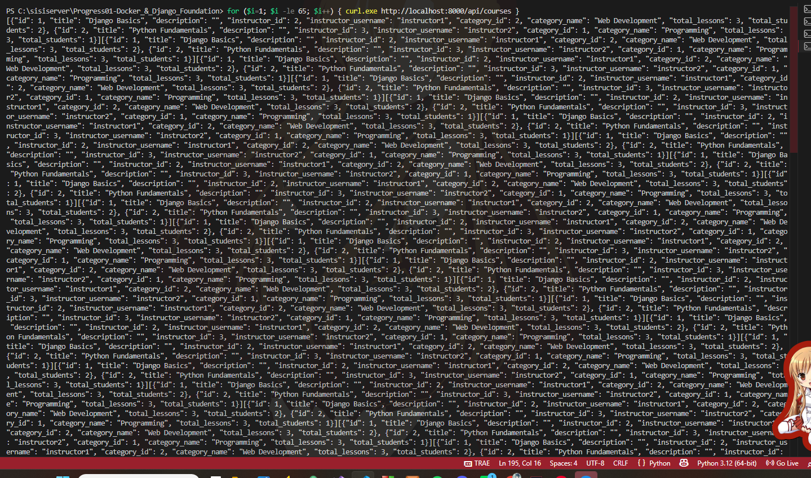

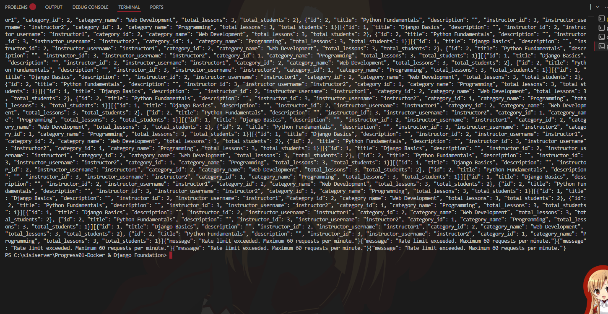

---

## MongoDB Integration

MongoDB digunakan untuk menyimpan data yang berbentuk log dan analytics. Data ini tidak disimpan di PostgreSQL karena sifatnya lebih fleksibel dan cocok untuk document-based storage.

MongoDB digunakan untuk dua collection utama:

| Collection           | Fungsi                                   |
| -------------------- | ---------------------------------------- |
| `activity_logs`      | Menyimpan aktivitas user dan sistem      |
| `learning_analytics` | Menyimpan aktivitas pembelajaran student |

### Activity Log Collection

Collection `activity_logs` menyimpan beberapa aktivitas seperti:

* Melihat daftar course
* Melihat detail course
* Student enroll ke course
* Student menyelesaikan lesson

Contoh action yang tersimpan:

```txt
course_list_viewed
course_detail_viewed
student_enrolled
lesson_completed
```

### Learning Analytics Collection

Collection `learning_analytics` menyimpan aktivitas pembelajaran student seperti:

```txt
course_enrolled
lesson_completed
```

Data ini dapat digunakan untuk melihat aktivitas pembelajaran student dalam course tertentu.

### MongoDB Shell Testing

Masuk ke MongoDB shell:

```bash
docker exec -it simple_lms_mongodb mongosh
```

Pilih database:

```javascript
use simple_lms_logs
```

Melihat collections:

```javascript
show collections
```

Melihat activity logs:

```javascript
db.activity_logs.find().pretty()
```

Melihat learning analytics:

```javascript
db.learning_analytics.find().pretty()
```

### Screenshot MongoDB Activity Logs

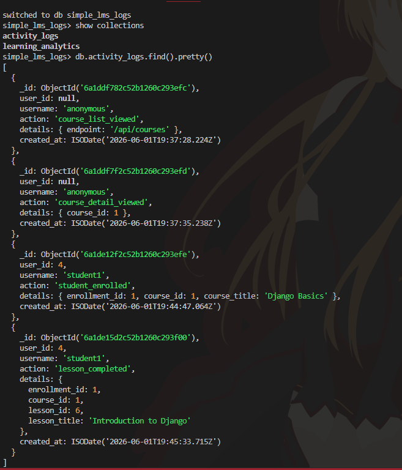

### Screenshot MongoDB Learning Analytics

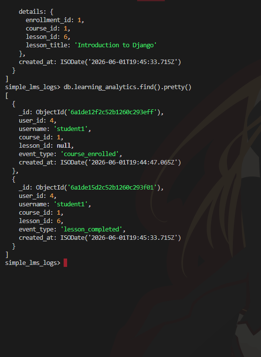

---

## MongoDB Aggregation Queries

Aggregation query dibuat untuk menghasilkan laporan dari data MongoDB.

Endpoint yang dibuat:

| Method | Endpoint                          | Fungsi                                                                  |
| ------ | --------------------------------- | ----------------------------------------------------------------------- |
| GET    | `/api/analytics/activity-summary` | Menampilkan jumlah aktivitas berdasarkan action                         |
| GET    | `/api/analytics/learning-summary` | Menampilkan jumlah aktivitas learning berdasarkan course dan event type |

Endpoint ini hanya dapat diakses oleh user dengan role admin.

### Activity Summary

Endpoint:

```txt
GET /api/analytics/activity-summary
```

Contoh hasil response:

```json
[
  {
    "action": "course_list_viewed",
    "total": 1
  },
  {
    "action": "course_detail_viewed",
    "total": 1
  },
  {
    "action": "lesson_completed",
    "total": 1
  },
  {
    "action": "student_enrolled",
    "total": 1
  }
]
```

### Learning Summary

Endpoint:

```txt
GET /api/analytics/learning-summary
```

Contoh hasil response:

```json
[
  {
    "course_id": 1,
    "event_type": "lesson_completed",
    "total": 1
  },
  {
    "course_id": 1,
    "event_type": "course_enrolled",
    "total": 1
  }
]
```

### Screenshot Activity Summary

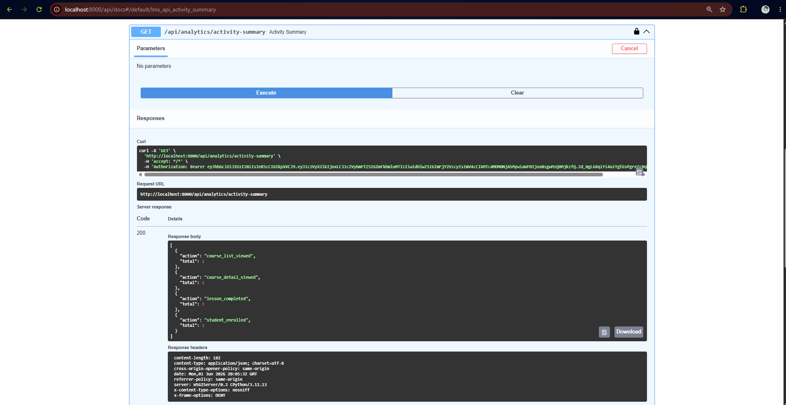

### Screenshot Learning Summary

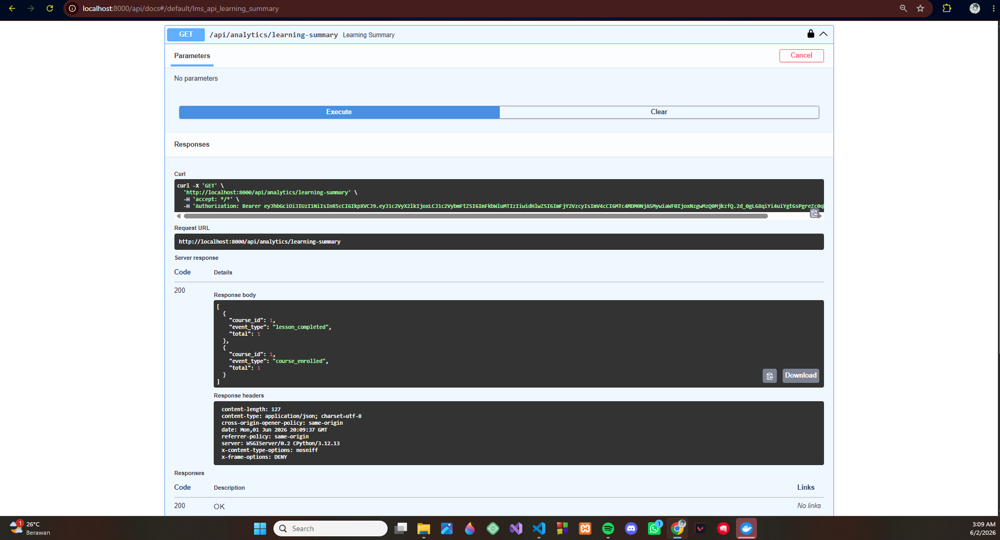

---

## Celery Integration

Celery digunakan untuk menjalankan task secara asynchronous. Pada Progress 4 ini, RabbitMQ digunakan sebagai message broker, sedangkan Redis digunakan sebagai result backend.

Celery configuration ditambahkan pada project Django melalui file:

```txt
config/celery.py
```

Selain itu, `config/__init__.py` juga diperbarui agar Celery app dapat terbaca saat Django berjalan.

---

## Celery Tasks

Empat task utama yang dibuat pada Progress 4 adalah:

| Task                       | Fungsi                                                 |
| -------------------------- | ------------------------------------------------------ |
| `send_enrollment_email`    | Mensimulasikan pengiriman email setelah student enroll |
| `generate_certificate`     | Membuat certificate number setelah course selesai      |
| `update_course_statistics` | Mengupdate statistik course                            |
| `export_course_report`     | Membuat report course secara asynchronous              |

Task disimpan pada file:

```txt
lms/tasks.py
```

### Testing Celery Tasks

Task diuji melalui Django shell:

```bash
docker exec -it simple_lms_web python manage.py shell
```

Import task:

```python
from lms.tasks import send_enrollment_email, generate_certificate, update_course_statistics, export_course_report
```

Menjalankan task:

```python
send_enrollment_email.delay(1)
generate_certificate.delay(1)
update_course_statistics.delay()
export_course_report.delay()
```

Hasil pengujian menunjukkan bahwa semua task berhasil berjalan dengan status `SUCCESS`.

### Screenshot Celery Tasks

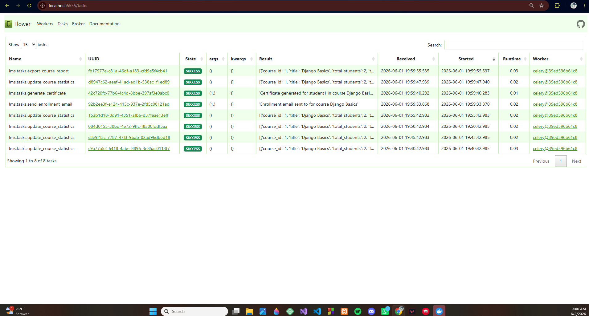

---

## Celery Beat

Celery Beat digunakan untuk menjalankan scheduled task. Pada project ini, task `update_course_statistics` dijalankan secara otomatis setiap 5 menit.

Konfigurasi schedule:

```python
CELERY_BEAT_SCHEDULE = {
    "update-course-statistics-every-5-minutes": {
        "task": "lms.tasks.update_course_statistics",
        "schedule": 300.0,
    },
}
```

Dengan konfigurasi ini, sistem dapat memperbarui statistik course secara berkala tanpa perlu request manual dari user.

---

## Flower Monitoring

Flower digunakan untuk memonitor Celery worker dan task yang berjalan.

Flower dapat diakses melalui:

```txt
http://localhost:5555
```

Pada dashboard Flower, dapat dilihat:

* Worker status
* Total processed task
* Failed task
* Successful task
* Runtime task
* Task result

### Screenshot Flower Dashboard

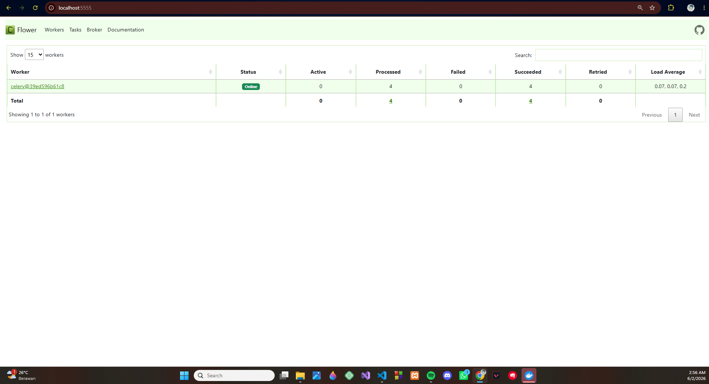

---

## RabbitMQ Message Broker

RabbitMQ digunakan sebagai message broker untuk Celery. RabbitMQ menerima task dari Django, lalu mengirimkannya ke Celery worker untuk diproses.

RabbitMQ Management dapat diakses melalui:

```txt
http://localhost:15672
```

Login default:

```txt
username: guest
password: guest
```

### Screenshot RabbitMQ Dashboard

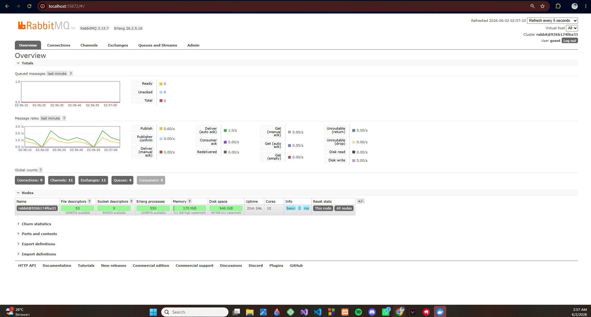

---

## Architecture Diagram

Berikut adalah diagram arsitektur Progress 4:

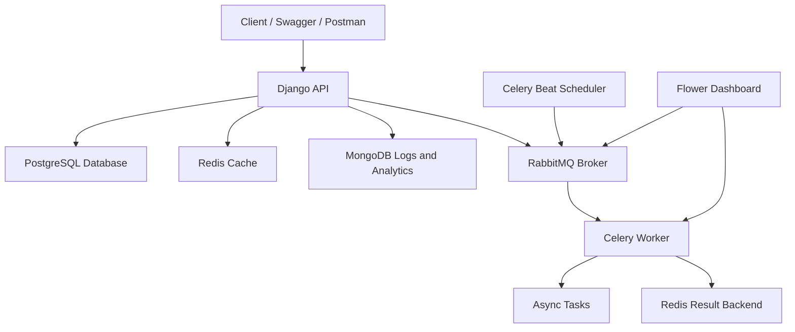

---

## Task Flow Documentation

### Enrollment Task Flow

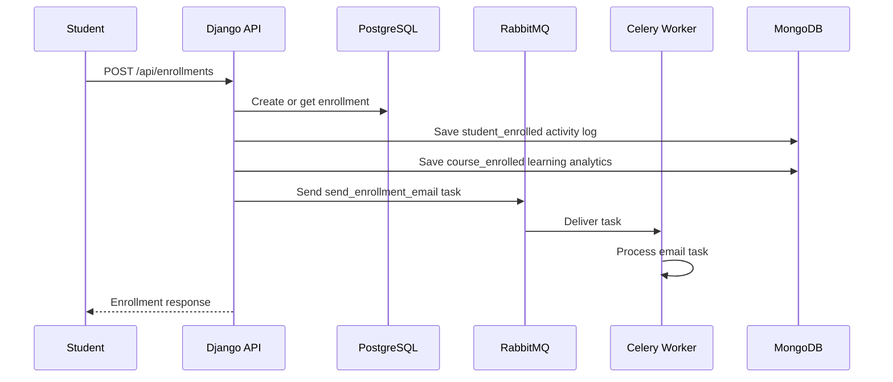

### Lesson Complete Task Flow

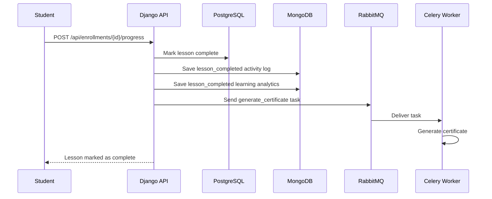

---

## Hasil Pengujian

| Pengujian                                        | Hasil    |
| ------------------------------------------------ | -------- |
| Docker Compose menjalankan semua services        | Berhasil |
| Redis course list caching                        | Berhasil |
| Redis course detail caching                      | Berhasil |
| Cache TTL aktif                                  | Berhasil |
| Cache invalidation saat course berubah           | Berhasil |
| Rate limiting 60 requests/minute                 | Berhasil |
| MongoDB activity logs                            | Berhasil |
| MongoDB learning analytics                       | Berhasil |
| MongoDB aggregation activity summary             | Berhasil |
| MongoDB aggregation learning summary             | Berhasil |
| Celery worker berjalan                           | Berhasil |
| Celery Beat scheduled task berjalan              | Berhasil |
| Empat Celery task berjalan dengan status success | Berhasil |
| Flower monitoring berjalan                       | Berhasil |
| RabbitMQ management berjalan                     | Berhasil |

---

## Kesimpulan

Pada Progress 4 ini, saya berhasil mengintegrasikan beberapa fitur lanjutan pada backend Simple LMS. Redis digunakan untuk caching dan rate limiting, MongoDB digunakan untuk activity logs dan learning analytics, RabbitMQ digunakan sebagai message broker, Celery digunakan untuk asynchronous task processing, Celery Beat digunakan untuk scheduled task, dan Flower digunakan untuk monitoring.

Dengan implementasi ini, sistem Simple LMS menjadi lebih lengkap dan lebih siap untuk digunakan sebagai backend LMS yang memiliki performa lebih baik, logging yang fleksibel, asynchronous processing, serta monitoring task.
