# Progress 3: Simple LMS - REST API & Authentication System

## Deskripsi Project

Project ini merupakan lanjutan dari Progress 1 dan Progress 2 pada mata kuliah Pemrograman Sisi Server. Pada Progress 3 ini, saya mengembangkan backend **Simple LMS** dengan menambahkan fitur **REST API**, **JWT Authentication**, **Role-Based Access Control (RBAC)**, validasi schema, serta dokumentasi API menggunakan Swagger.

Sebelumnya, pada Progress 1 project sudah dikonfigurasi menggunakan Docker dan Django. Pada Progress 2, saya telah membuat desain database dan implementasi model menggunakan Django ORM. Pada Progress 3 ini, model yang sudah dibuat dikembangkan menjadi API agar sistem dapat digunakan oleh client atau frontend secara terstruktur.

---

## Tujuan Progress 3

Tujuan dari Progress 3 ini adalah:

1. Membuat REST API menggunakan Django Ninja.
2. Mengimplementasikan sistem autentikasi menggunakan JWT.
3. Menerapkan pembatasan akses berdasarkan role user.
4. Menggunakan schema validation untuk request dan response API.
5. Menyediakan dokumentasi API menggunakan Swagger.
6. Melakukan pengujian endpoint menggunakan Swagger dan Postman.

---

## Teknologi yang Digunakan

Teknologi yang digunakan dalam Progress 3 ini adalah:

* Python
* Django
* Django Ninja
* PyJWT
* Docker
* Docker Compose
* SQLite / PostgreSQL sesuai konfigurasi project
* Swagger Documentation
* Postman

---

## Role User

Pada sistem Simple LMS ini terdapat tiga role utama:

| Role       | Deskripsi                                                            |
| ---------- | -------------------------------------------------------------------- |
| Admin      | User yang memiliki akses untuk menghapus course                      |
| Instructor | User yang dapat membuat dan mengubah course miliknya sendiri         |
| Student    | User yang dapat enroll ke course dan menandai lesson sebagai selesai |

Role user disimpan melalui model `UserProfile`, sehingga setiap user memiliki profile dengan role tertentu.

---

## Fitur yang Diimplementasikan

### 1. REST API Menggunakan Django Ninja

Pada Progress 3 ini, saya menggunakan Django Ninja untuk membuat endpoint API. Django Ninja dipilih karena mendukung pembuatan REST API dengan struktur yang sederhana, cepat, dan otomatis menghasilkan dokumentasi Swagger.

Endpoint API yang dibuat meliputi:

* Authentication
* Course management
* Enrollment
* Lesson progress

---

### 2. JWT Authentication

JWT Authentication digunakan untuk mengamankan endpoint tertentu. Setelah user berhasil login, sistem akan memberikan dua token, yaitu:

* Access token
* Refresh token

Access token digunakan untuk mengakses endpoint yang membutuhkan autentikasi. Token dikirim melalui header:

```txt
Authorization: Bearer <access_token>
```

Endpoint yang membutuhkan autentikasi tidak dapat diakses tanpa token yang valid.

---

### 3. Role-Based Access Control

Role-Based Access Control digunakan untuk membatasi hak akses user berdasarkan role masing-masing.

Beberapa aturan akses yang diterapkan adalah:

* Hanya instructor yang dapat membuat course.
* Student tidak dapat membuat course.
* Hanya owner course yang dapat mengubah course.
* Hanya admin yang dapat menghapus course.
* Hanya student yang dapat enroll ke course.
* Hanya student yang dapat menandai lesson sebagai selesai.

Dengan aturan ini, sistem dapat memastikan bahwa setiap user hanya dapat melakukan aksi yang sesuai dengan role-nya.

---

### 4. Schema Validation

Schema validation digunakan untuk memastikan data request dan response sesuai dengan struktur yang dibutuhkan oleh API. Schema dibuat menggunakan fitur schema dari Django Ninja.

Beberapa schema yang dibuat antara lain:

* RegisterSchema
* LoginSchema
* TokenSchema
* UserOutSchema
* CourseCreateSchema
* CourseUpdateSchema
* EnrollmentCreateSchema
* ProgressCreateSchema
* MessageSchema
* ErrorSchema

Dengan adanya schema, data yang masuk ke API menjadi lebih terkontrol dan mengurangi kemungkinan error akibat format data yang tidak sesuai.

---

### 5. Swagger API Documentation

Django Ninja secara otomatis menyediakan dokumentasi API melalui Swagger. Dokumentasi ini dapat digunakan untuk melihat daftar endpoint, struktur request body, response, dan juga melakukan testing langsung melalui browser.

Swagger dapat diakses melalui URL:

```txt
http://localhost:8000/api/docs
```

---

## Daftar Endpoint API

### Authentication Endpoint

| Method | Endpoint             | Deskripsi                                    | Akses         |
| ------ | -------------------- | -------------------------------------------- | ------------- |
| POST   | `/api/auth/register` | Mendaftarkan user baru                       | Public        |
| POST   | `/api/auth/login`    | Login dan mendapatkan JWT token              | Public        |
| POST   | `/api/auth/refresh`  | Membuat access token baru dari refresh token | Public        |
| GET    | `/api/auth/me`       | Menampilkan data user yang sedang login      | Authenticated |
| PUT    | `/api/auth/me`       | Mengubah profile user yang sedang login      | Authenticated |

---

### Course Endpoint

| Method | Endpoint                   | Deskripsi                 | Akses        |
| ------ | -------------------------- | ------------------------- | ------------ |
| GET    | `/api/courses`             | Menampilkan semua course  | Public       |
| GET    | `/api/courses/{course_id}` | Menampilkan detail course | Public       |
| POST   | `/api/courses`             | Membuat course baru       | Instructor   |
| PATCH  | `/api/courses/{course_id}` | Mengubah course           | Owner course |
| DELETE | `/api/courses/{course_id}` | Menghapus course          | Admin        |

---

### Enrollment dan Progress Endpoint

| Method | Endpoint                                    | Deskripsi                               | Akses   |
| ------ | ------------------------------------------- | --------------------------------------- | ------- |
| POST   | `/api/enrollments`                          | Student enroll ke course                | Student |
| GET    | `/api/enrollments/my-courses`               | Menampilkan course yang diikuti student | Student |
| POST   | `/api/enrollments/{enrollment_id}/progress` | Menandai lesson sebagai selesai         | Student |

---

## Struktur File Progress 3

Pada Progress 3 ini, beberapa file utama yang digunakan adalah:

```txt
simple-lms/
├── config/
│   ├── settings.py
│   └── urls.py
├── lms/
│   ├── api.py
│   ├── auth.py
│   ├── schemas.py
│   ├── permissions.py
│   ├── models.py
│   ├── managers.py
│   └── admin.py
├── Dockerfile
├── docker-compose.yml
├── manage.py
├── requirements.txt
└── README.md
```

Penjelasan file:

| File                 | Penjelasan                                  |
| -------------------- | ------------------------------------------- |
| `lms/api.py`         | Berisi seluruh endpoint API                 |
| `lms/auth.py`        | Berisi fungsi JWT token dan autentikasi     |
| `lms/schemas.py`     | Berisi schema validasi request dan response |
| `lms/permissions.py` | Berisi helper untuk pengecekan role         |
| `config/urls.py`     | Menghubungkan API ke URL utama project      |
| `requirements.txt`   | Berisi dependency yang digunakan            |

---

## Cara Menjalankan Project

### 1. Menjalankan Docker

```bash
docker compose up --build
```

### 2. Membuka Django

```txt
http://localhost:8000
```

### 3. Membuka Swagger Documentation

```txt
http://localhost:8000/api/docs
```

---

## Cara Testing API

### 1. Register User

Endpoint:

```txt
POST /api/auth/register
```

Contoh request body:

```json
{
  "username": "instructor3",
  "email": "instructor3@example.com",
  "password": "instructor123",
  "role": "instructor"
}
```

---

### 2. Login User

Endpoint:

```txt
POST /api/auth/login
```

Contoh request body:

```json
{
  "username": "student1",
  "password": "Classroom#2026"
}
```

Jika berhasil, sistem akan mengembalikan access token dan refresh token.

---

### 3. Mengakses Current User

Endpoint:

```txt
GET /api/auth/me
```

Endpoint ini membutuhkan JWT access token pada Authorization header.

---

### 4. Instructor Membuat Course

Endpoint:

```txt
POST /api/courses
```

Contoh request body:

```json
{
  "title": "Django REST API Fundamentals",
  "description": "This course introduces Django Ninja API, JWT authentication, and backend development basics.",
  "category_id": null
}
```

Endpoint ini hanya dapat diakses oleh user dengan role instructor.

---

### 5. Student Tidak Dapat Membuat Course

Ketika user dengan role student mencoba mengakses endpoint:

```txt
POST /api/courses
```

Sistem akan memberikan response:

```json
{
  "message": "Only instructors can create courses."
}
```

Status response:

```txt
403 Forbidden
```

Hal ini menunjukkan bahwa RBAC sudah berjalan dengan benar.

---

### 6. Student Enroll ke Course

Endpoint:

```txt
POST /api/enrollments
```

Contoh request body:

```json
{
  "course_id": 1
}
```

---

### 7. Student Menandai Lesson Sebagai Selesai

Endpoint:

```txt
POST /api/enrollments/{enrollment_id}/progress
```

Contoh request body:

```json
{
  "lesson_id": 6
}
```

Jika berhasil, sistem akan memberikan response:

```json
{
  "message": "Lesson marked as complete."
}
```

---

### 8. Admin Menghapus Course

Endpoint:

```txt
DELETE /api/courses/{course_id}
```

Endpoint ini hanya dapat diakses oleh user dengan role admin.

Jika berhasil, sistem akan memberikan response:

```json
{
  "message": "Course deleted successfully."
}
```

---

## Hasil Pengujian

Berikut adalah hasil pengujian endpoint yang telah dilakukan:

| Pengujian                                  | Hasil                        |
| ------------------------------------------ | ---------------------------- |
| Register user                              | Berhasil                     |
| Login user dan mendapatkan token           | Berhasil                     |
| Mengakses `/api/auth/me` menggunakan token | Berhasil                     |
| Instructor membuat course                  | Berhasil                     |
| Student mencoba membuat course             | Ditolak dengan 403 Forbidden |
| Student enroll ke course                   | Berhasil                     |
| Student melihat course yang diikuti        | Berhasil                     |
| Student menandai lesson selesai            | Berhasil                     |
| Admin menghapus course                     | Berhasil                     |

---

## Dokumentasi Screenshot

Screenshot yang digunakan sebagai bukti implementasi:

1. Halaman Swagger API Documentation.
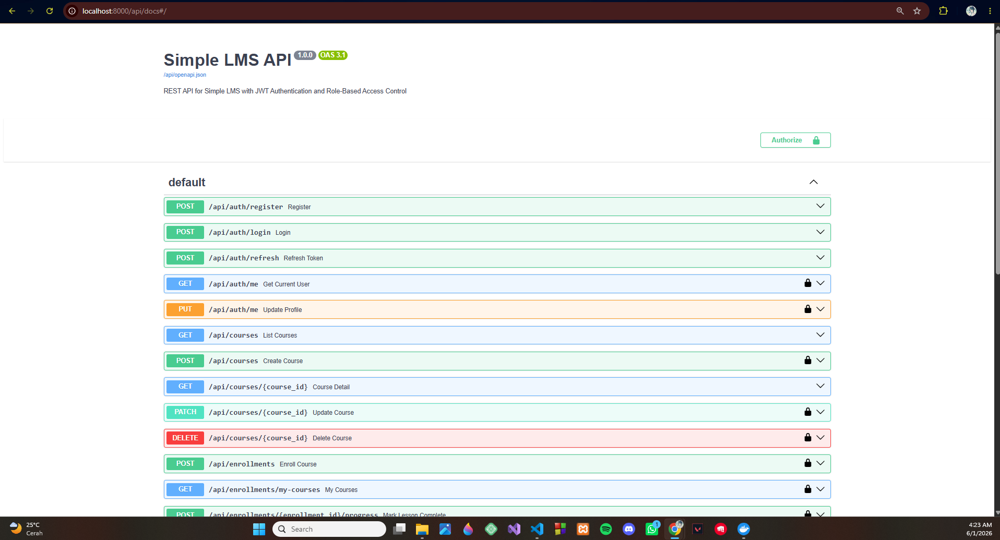
2. Endpoint register user berhasil.
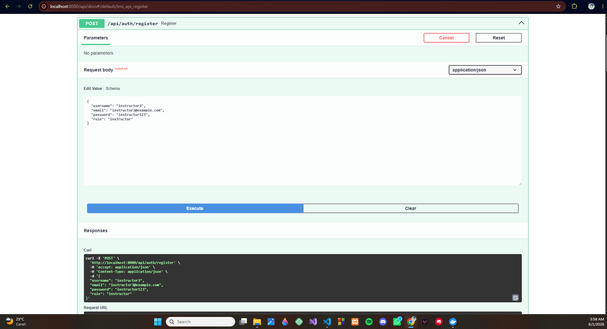
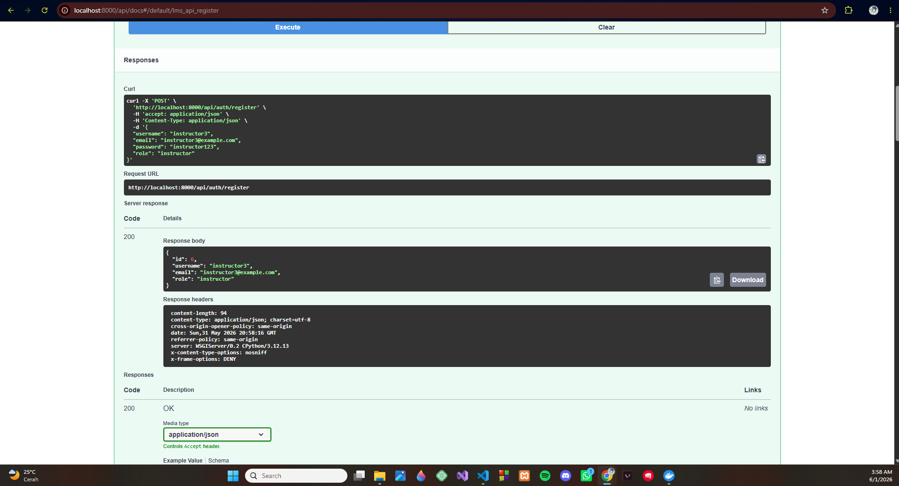
3. Endpoint login berhasil dan menghasilkan JWT token.
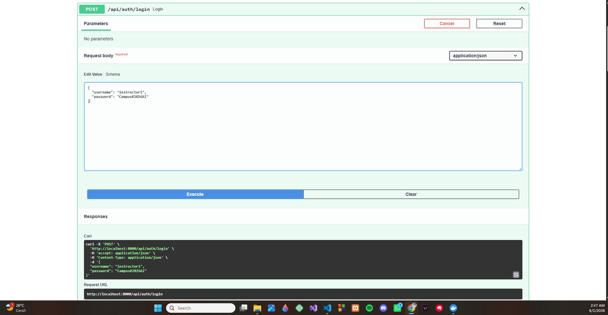
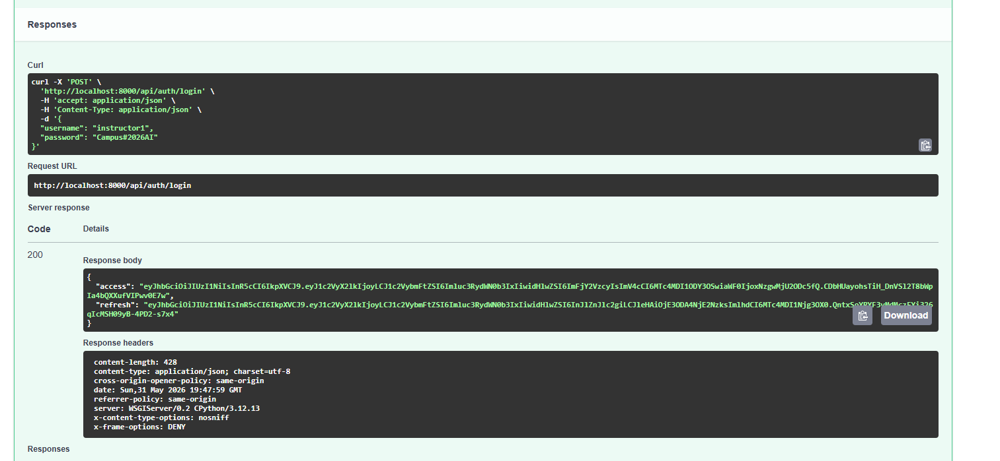
4. Endpoint current user berhasil menggunakan Bearer token.

5. Instructor berhasil membuat course.
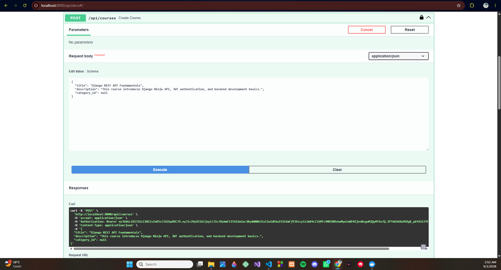
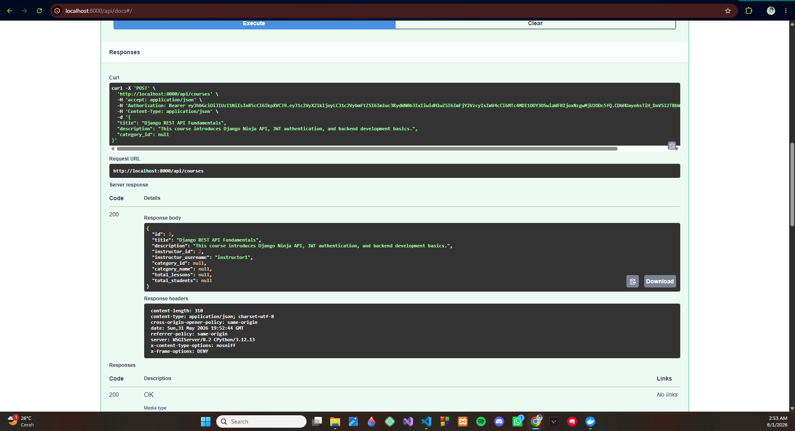
6. Student gagal membuat course karena tidak memiliki akses.
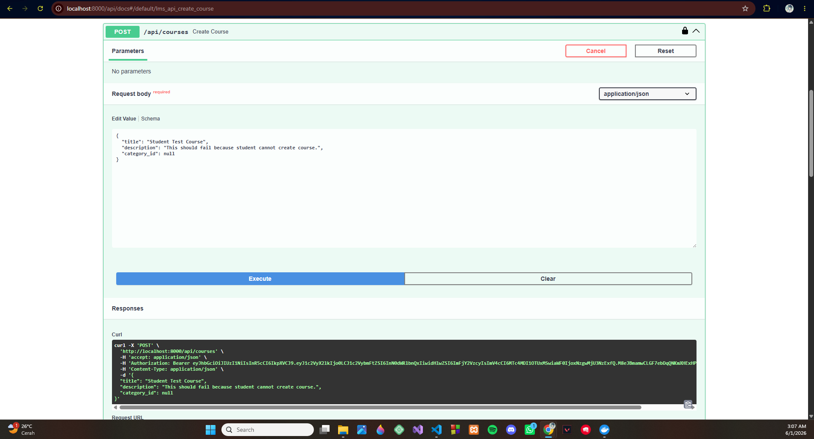
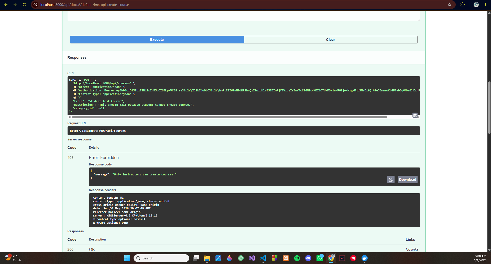
7. Student berhasil enroll ke course.
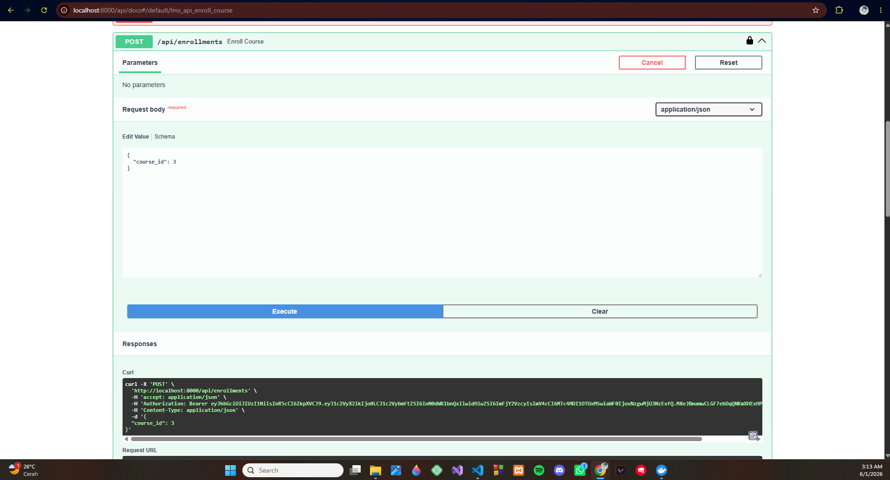
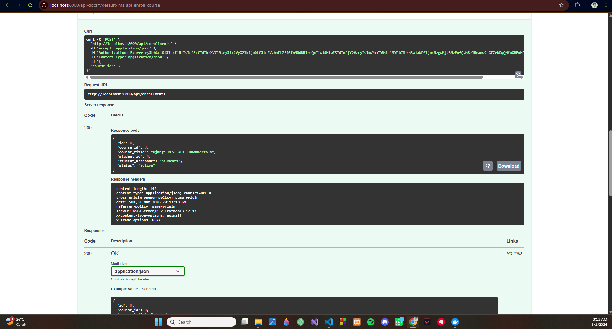
8. Student berhasil menandai lesson sebagai selesai.
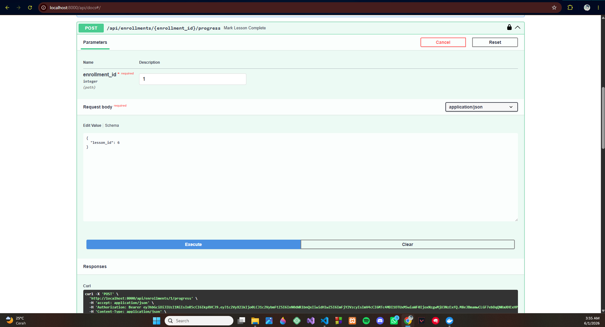
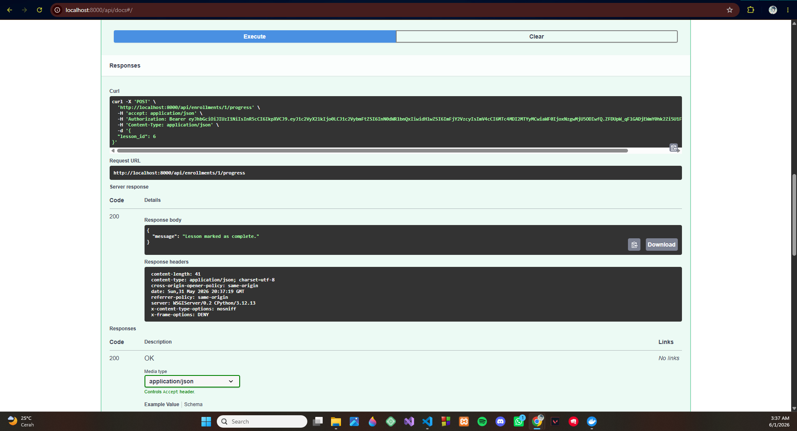
9. Admin berhasil menghapus course.
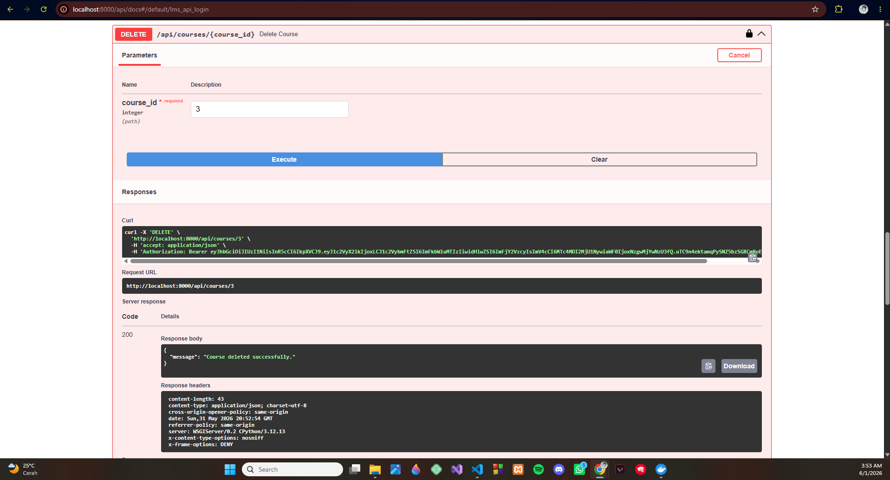

---

## Postman Collection

Selain menggunakan Swagger, endpoint juga dapat diuji menggunakan Postman. Postman Collection berisi endpoint utama seperti:

* Register
* Login
* Refresh token
* Current user
* Update profile
* List courses
* Course detail
* Create course
* Update course
* Delete course
* Enroll course
* My courses
* Mark lesson complete

---

## Kesimpulan

Pada Progress 3 ini, saya berhasil mengembangkan Simple LMS menjadi backend yang memiliki REST API lengkap. Sistem sudah mendukung autentikasi menggunakan JWT, pembatasan akses berdasarkan role user, validasi schema, serta dokumentasi API menggunakan Swagger.

Dengan implementasi ini, backend Simple LMS sudah dapat digunakan oleh frontend atau client lain untuk melakukan proses autentikasi, pengelolaan course, enrollment, dan progress lesson.
